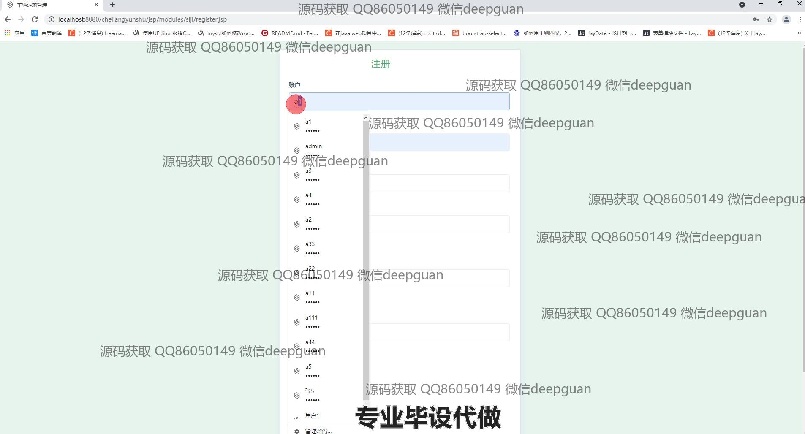

<h1 align="center">车辆运输管理</h1>

## 简介
车辆运输管理系统：角色包括司机和管理员；功能涵盖司机管理、车辆管理、订单管理、公告管理和个人中心。系统采用高效界面设计，便于信息录入和管理，提高运输业务流程的效率。    --计算机毕业设计源码；毕设源码；java毕业设计源码

## 联系方式

<h3 align="center">获取完整代码与数据库文件 + 微信：deepguan QQ: 86050149 QQ群: 783742310</h3>

<h3 align="center">可帮忙远程部署 包运行成功！提供远程部署、修改代码、设计文档指导、代码讲解等服务！</h3>

## 功能介绍（完整见运行截图）
管理员：管理员可以管理与维护系统中的核心信息，包括注册、管理账号和权限设置。提供司机管理功能，包括新增、修改、查看、重置密码等操作。在车辆和订单管理模块中，管理员可增删改查订单与车辆信息，并能查看详细运输记录。公告管理模块允许管理员添加、修改、删除公告类型，以便于公司内部的信息发布与管理。

司机：司机可以通过注册页面输入基本信息进行个人账户的创建与管理，上传个人照片和提供详细身份信息。在个人中心页面，司机可以查看和修改自己的信息，包括姓名、手机号、身份证号和状态等。司机状态会在运输订单状态更新时自动变化，提升信息维护的效率。

用户：用户可以登录、注册并访问网站首页，查看并管理车辆运输相关的各类信息。通过订单管理模块，用户能查询、添加、删除或修改订单，确保运输过程的透明和高效。导航栏使用户能快速访问不同模块，如主页、司机管理、车辆管理和公告管理，实现系统内的轻松操作和数据管理。

运输管理人员：能够使用系统的订单管理功能查看订单列表，包含车辆、司机、商品等详细信息，并通过筛选条件进行精确查询。运输管理人员可以通过公告类型管理模块进行信息的快速发布和档案的高效检索，确保公司公告的及时性和准确性。

## 运行截图

本代码来源于网络,仅供学习参考使用!

